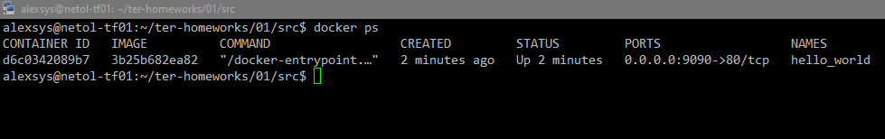

# Введение в Terraform

Работы будем выполнять в ВМ Ubuntu 22.04 LTS.

Версия Docker:


Версия Terraform:


1. Для установки зависимостей скопируем в профиль пользователя файйл `.terraformrc` и выполним команду ``terraform init``:


2. Секретные данные должны храниться в фале `personal.auto.tfvars`
3. Выполним команду `terraform apply`:


Сгенерированное значение пароля находится в ключе `result`:

``       "result": "Vo27QRHJ6pxHS58l",``

4. Раскомментируем указанный код, и выполним команду `terraform validate`:

```
alexsys@netol-tf01:~/ter-homeworks/01/src$ terraform validate
╷
│ Error: Missing name for resource
│
│   on main.tf line 24, in resource "docker_image":
│   24: resource "docker_image" {
│
│ All resource blocks must have 2 labels (type, name).
╵
╷
│ Error: Invalid resource name
│
│   on main.tf line 29, in resource "docker_container" "1nginx":
│   29: resource "docker_container" "1nginx" {
│
│ A name must start with a letter or underscore and may contain only letters, digits, underscores, and dashes.

```
Видим 2 ошибки:
- у ресурса `"docker_container"` нет имени. Дадим ему имя `nginx`
- ресурс `"docker_container"` имеет имя, начинающееся с цифры. Уберём её и выполним `terraform validate` ещё раз.

```json
alexsys@netol-tf01:~/ter-homeworks/01/src$ terraform validate
╷
│ Error: Reference to undeclared resource
│
│   on main.tf line 31, in resource "docker_container" "nginx":
│   31:   name  = "example_${random_password.random_string_FAKE.resulT}"
│
│ A managed resource "random_password" "random_string_FAKE" has not been declared in the root module.

```

Появилась новая ошибка. Переменная, содержащая наш пароль названа неверно (Лишнее слово _FAKE и ошибка в регистрев слове result). Исправим и проверим:

```
alexsys@netol-tf01:~/ter-homeworks/01/src$ terraform validate
Success! The configuration is valid.
```

Успех. В итоге получился следующий код:

```terraform
resource "docker_image" "nginx"{
  name         = "nginx:latest"
  keep_locally = true
}

resource "docker_container" "nginx" {
  image = docker_image.nginx.image_id
  name  = "example_${random_password.random_string.result}"

  ports {
    internal = 80
    external = 9090
  }

```

5. Выполним команду `terraform apply`. Теперь она отрабатывает успешно, и мы получаем в результате наш контейнер:


6. Меняем имя контейнера и выполняем команду `terraform apply -auto-approve`. Видим наш контейнер с новым именем:



Ключ `-auto-approve` опасен тем, что применяет созданный план сразу, без запроса подтверждения пользователя. 
Мы не видим, что конкретно будет сделано, что может привести к ошибкам и неожиданным результатам. 
Этим же и полезен, например, при автоматизации. Когда наоборот, ожидание интерактивного ввода недопустимо и приведёт к ошибкам. 

7. Для уничтожения ресурсов Выполним команду `terraform destroy`. Все 3 наших ресурса удалены:


Файл `.tfstate` также записей о них не содержит:

```terraform
{
  "version": 4,
  "terraform_version": "1.8.5",
  "serial": 18,
  "lineage": "730f7314-0daa-6d47-00e7-abd0ece73af2",
  "outputs": {},
  "resources": [],
  "check_results": null
}

```

8. Убеждаемся, что это действительно так:


Видим, что контейнера действительно нет, а вот образ остался. Это произошло потому, что в нашем коде ресурса `docker_image`
присутствует ключ `keep_locally = true`, который, согласно [документации](https://docs.comcloud.xyz/providers/kreuzwerker/docker/latest/docs/resources/image),
как раз и отвечает за то, удаляются ли образы при выполнении команды `destroy`.

Результирующий файл [main.tf](src/main.tf).
Файл [.tfstate](src/terraform.tfstate).
