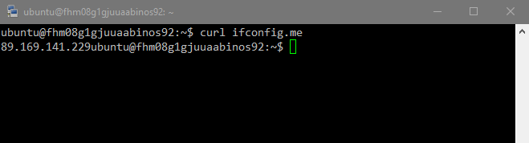
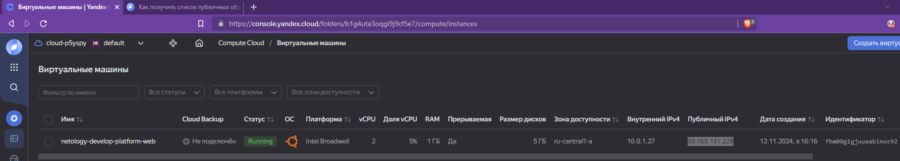
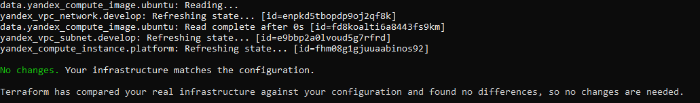
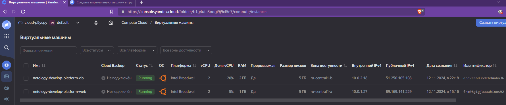
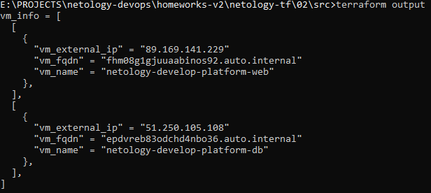

# Основы Terraform. Yandex Cloud
### Задание 1
1-3. Создаём файл `personal.auto.tfvars` и записываем туда значения наших `cloud_id`, `folder_id`  публичный ключ в соотвектствующие переменные.
4. Выполняем `terraform apply`.
Обнаруживаем следующие ошибки:
   - У ресурса yandex_compute_instance неверно указано значение платформы: `platform_id = "standart-v4"`. Слово 'standard' написано с ошибкой, кроме того, согласно документации, такого типа платформы вообще нет. Выберем для себя теп платформы `standard-v1`. 
   - Кроме того, согласно той же документации, минимальное количество ядер CPU для заказа -2. Исправляем.

    Наши ресурсы успешно созданы.
5. Подключаемся к нашей ВМ:

    

    Созданная машина в панели Yandex Cloud:

    

6. `core_fraction` - это параметр, отвечающий за гарантированный для ВМ процент времени ядра. От его значения зависит производительность, а так же стоимость использования ВМ. 
Таким образом, устанавливая его в минимальное значение мы экономим средства. 
   
    `preemptible`- Согласно [документации](https://yandex.cloud/en-ru/docs/compute/concepts/preemptible-vm) - стоимость "прерываемых" машин с таким флагом существенно ниже.
   Кроме того, срок жизни такой ВМ 24 часа. Этот флаг также поможет сэкономить средства и не потратить лишних денег на "потерянную" вследствие ошибок или невнимательности ВМ.  

### Заданиие 2
Заменяем переменными все константы в ресурсах `yandex_compute_image` и `yandex_compute_instance`. После замены в файле `variables.tf` добавились следующие переменные:

```terraform
### vm variables
variable "vms_image_family" {
  type        = string
  default     = "ubuntu-2004-lts"
  description = "VM image family"
}

variable "vm_web_name" {
  type        = string
  default     = "netology-develop-platform-web"
  description = "Web VM name"
}

variable "vm_web_platform" {
  type        = string
  default     = "standard-v1"
  description = "Web VM platform type"
}

variable "vm_web_res_cpu" {
  type        = number
  default     = 2
  description = "Web VM CPU cores"
}

variable "vm_web_res_core_fraction" {
  type        = number
  default     = 5
  description = "Web VM cpu fraction"
}

variable "vm_web_res_memory" {
  type        = number
  default     = 1
  description = "Web VM memory size"
}

variable "vm_web_preemptive" {
  type        = bool
  default     = true
  description = "Web VM preemptive"
}

variable "vm_web_net_nat" {
  type        = bool
  default     = true
  description = "Web VM NAT enable"
}

variable "vm_web_meta_serial" {
  type        = number
  default     = 1
  description = "Web VM console enable"
}

variable "vm_web_meta_ssh_user" {
  type        = string
  default     = "ubuntu"
  description = "Web VM SSH username"
}
```

А код ресурсов стал выглядеть так:

```terraform
data "yandex_compute_image" "ubuntu" {
  family = var.vms_image_family
}
resource "yandex_compute_instance" "platform" {
  name        = var.vm_web_name
  platform_id = var.vm_web_platform
  resources {
    cores         = var.vm_web_res_cpu
    memory        = var.vm_web_res_memory
    core_fraction = var.vm_web_res_core_fraction
  }
  boot_disk {
    initialize_params {
      image_id = data.yandex_compute_image.ubuntu.image_id
    }
  }
  scheduling_policy {
    preemptible = var.vm_web_preemptible
  }
  network_interface {
    subnet_id = yandex_vpc_subnet.develop.id
    nat       = var.vm_web_net_nat
  }

  metadata = {
    serial-port-enable = var.vm_web_meta_serial
    ssh-keys           = "${var.vm_web_meta_ssh_user}:${var.vms_ssh_root_key}"
  }

}
```

Проверяем с помощью `terraform plan`: 



Ничего не поменялось.

### Задание 3

Чтобы вторая ВМ работала в другой зоне доступности, нам понадобится создать дополнительную подсеть. 
```terraform
resource "yandex_vpc_subnet" "develop-db" {
  name           = var.vm_db_net_name
  zone           = var.vm_db_zone
  network_id     = yandex_vpc_network.develop.id
  v4_cidr_blocks = var.vm_db_net_cidr
}
```
Таким образом, набор переменных для второй машины выглядит так:
```terraform
variable "vm_db_name" {
  type        = string
  default     = "netology-develop-platform-db"
  description = "DB VM name"
}

variable "vm_db_platform" {
  type        = string
  default     = "standard-v1"
  description = "DB VM platform type"
}

variable "vm_db_res_cpu" {
  type        = number
  default     = 2
  description = "DB VM CPU cores"
}

variable "vm_db_res_core_fraction" {
  type        = number
  default     = 20
  description = "DB VM cpu fraction"
}

variable "vm_db_res_memory" {
  type        = number
  default     = 2
  description = "DB VM memory size"
}

variable "vm_db_preemptive" {
  type        = bool
  default     = true
  description = "DB VM preemptive"
}

variable "vm_db_net_nat" {
  type        = bool
  default     = true
  description = "DB VM NAT enable"
}

variable "vm_db_meta_serial" {
  type        = number
  default     = 1
  description = "DB VM console enable"
}

variable "vm_db_meta_ssh_user" {
  type        = string
  default     = "ubuntu"
  description = "DB VM SSH username"
}

variable "vm_db_zone" {
  type        = string
  default     = "ru-central1-b"
  description = "DB VM availability zone"
}

variable "vm_db_net_cidr" {
  type        = list(string)
  default     = ["10.0.2.0/24"]
  description = "https://cloud.yandex.ru/docs/vpc/operations/subnet-create"
}

variable "vm_db_net_name" {
  type        = string
  default     = "develop-db"
  description = "VPC network & subnet name"
}
```

Запускаем. Получили нашу ВМ:




### Задание 4
Создадим output-переменную `vm_info`, где перечислим требуемые параметры:



### Задание 5
Сделаем переменные `vm_*_name` локальными и опишем их в файле `locals.tf`:
```terraform
locals {
  vm_web_name = "${var.vms_name_prefix}-${var.vm_web_name_suffix}"
  vm_db_name = "${var.vms_name_prefix}-${var.vm_db_name_suffix}"
}
```
Переменные `vms_name_prefix, vm_*_name_suffix` опишем в файле `vms_platform.tf` и присвоим им значения по умолчанию
"netology-develop-platform", "web" и "db".

Выполним `terraform plan`:
```commandline
>terraform plan
data.yandex_compute_image.ubuntu: Reading...
yandex_vpc_network.develop: Refreshing state... [id=enpkd5tbopdp9oj2qf8k]
data.yandex_compute_image.ubuntu: Read complete after 0s [id=fd8koalti6a8443fs9km]
yandex_vpc_subnet.develop: Refreshing state... [id=e9bbp2a0lvoud5g7rfrd]
yandex_vpc_subnet.develop-db: Refreshing state... [id=e2l9ccoma04gdc6rn5rm]
yandex_compute_instance.platform: Refreshing state... [id=fhm08g1gjuuaabinos92]
yandex_compute_instance.platform_db: Refreshing state... [id=epdvreb83odchd4nbo36]

No changes. Your infrastructure matches the configuration.

Terraform has compared your real infrastructure against your configuration and found no differences, so no changes are needed.
```

Ничего не изменилось.

### Задание 6
Создадим в файле `vms_platform.tf` две map-переменные для ресурсов и метаданных наших ВМ и зададим им значения по умолчанию из сооответствующих отдельных переменных:

```terraform
variable "vms_resources" {
  type = map(object({
    cores = number
    cores_fraction = number
    memory = number
  }))
  default = {
    "web" = {
      cores = 2
      cores_fraction = 5
      memory = 1
    },
    "db" = {
      cores = 2
      cores_fraction = 20
      memory = 2
    }
  }
}

variable "vms_metadata" {
  type = map(object({
    serial-port-enable = number
    ssh-keys = string
  }))
  default = {
    "value" = {
      serial-port-enable = 1
      ssh-keys           = "ubuntu:ecdsa-sha2-nistp256 AAAAE2VjZHNhLXNoYTItbmlzdHAyNTYAAAAIbmlzdHAyNTYAAABBBN7IauozMX1+kZMrnzIxvsxSVaI+DSxzjFIaa89RNMaRbnc/uZbeC+IHoK4PN8DgNZhA5z7Q4Ecil6z0GVTSW08="
    }
  }
}
```
Используем их в коде наших ресурсов. Закомментируем ставшие ненужными переменные. 
Проверим с помощью `terraform plan`. Ничего не изменилось.

Финальный код расположен в папке `src` репозитория.
