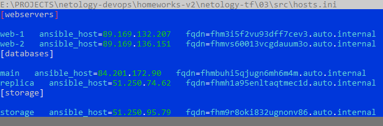

# Управляющие конструкции в коде Terraform
### Задание 1
Задаём персональные переменные и выполняем проект. Успешно. Получили нашу группу безопасности:


### Заданиие 2
Разделим все основные параметры наших ВМ на 3 блока:
- `vms_common_options` - параметры, общие для всех ВМ
- `vms_web_options` - параметры web-ВМ
- `vms_db_options`  - параметры ВМ БД

Код ресурса для web (`count-vm.tf`):
```terraform
resource "yandex_compute_instance" "web" {

  depends_on = [yandex_compute_instance.db]
  count = var.vms_web_vm_count
  name        = "${var.vms_web_name_prefix}-${count.index + 1}"
  platform_id = var.vms_common_options.platform

  resources {
    cores         = var.vms_web_options.cores
    memory        = var.vms_web_options.memory
    core_fraction = var.vms_web_options.cores_fraction
  }

  boot_disk {
    initialize_params {
      image_id = data.yandex_compute_image.ubuntu.image_id

    }
  }
  scheduling_policy {
    preemptible = var.vms_common_options.preemptive
  }

  network_interface {
    subnet_id = yandex_vpc_subnet.develop.id
    nat       = var.vms_common_options.net_nat
    security_group_ids = ["${yandex_vpc_security_group.example.id}"]
  }

  metadata = {
    serial-port-enable = var.vms_common_options.meta_serial-port-enable
    ssh-keys           = local.vms_ssh-keys
  }
}
```

Код для ВМ БД (`for_each-vm.tf`):

```terraform
resource "yandex_compute_instance" "db" {
  for_each = {
    for index, vm in var.vms_db_options:
    vm.name => vm
  }
  name        = each.value.name
  platform_id = var.vms_common_options.platform

  resources {
    cores         = each.value.cores
    memory        = each.value.memory
    core_fraction = each.value.cores_fraction
  }

  boot_disk {
    initialize_params {
      image_id = data.yandex_compute_image.ubuntu.image_id
      size = each.value.hdd_size
    }
  }
  scheduling_policy {
    preemptible = var.vms_common_options.preemptive
  }

  network_interface {
    subnet_id = yandex_vpc_subnet.develop.id
    nat       = var.vms_common_options.net_nat
  }

  metadata = {
    serial-port-enable = var.vms_common_options.meta_serial-port-enable
    ssh-keys           = local.vms_ssh-keys
  }
}
```
Применяем. Получили наши 4 ВМ:


### Задание 3
Создадим 3 отдельных диска и дополнительную storage-VM, предварительно объявив необходимые переменные:
```terraform
resource "yandex_compute_disk" "store-data" {
  count = var.vms_storage_disk_count
  name = "${var.vms_storage_disk_options.basename}-${count.index + 1}"
  size = var.vms_storage_disk_options.size
}

resource "yandex_compute_instance" "storage" {

  name        = var.vms_storage_vm_options.name
  platform_id = var.vms_common_options.platform

  resources {
    cores         = var.vms_storage_vm_options.cores
    memory        = var.vms_storage_vm_options.memory
    core_fraction = var.vms_storage_vm_options.cores_fraction
  }

  boot_disk {
    initialize_params {
      image_id = data.yandex_compute_image.ubuntu.image_id
    }
  }

  dynamic "secondary_disk" {
    for_each = yandex_compute_disk.store-data
    content {
      disk_id = lookup(secondary_disk.value, "id")
    }
  }

  scheduling_policy {
    preemptible = var.vms_common_options.preemptive
  }

  network_interface {
    subnet_id = yandex_vpc_subnet.develop.id
    nat       = var.vms_common_options.net_nat
  }

  metadata = {
    serial-port-enable = var.vms_common_options.meta_serial-port-enable
    ssh-keys           = local.vms_ssh-keys
  }
}
```
В результате получили ещё одну машину:


И наши диски:


### Задание 4
Создадим ресурс localfile следующего вида:
```terraform
resource "local_file" "hosts_templatefile" {
  content = templatefile("${path.module}/${var.ansible_hosts_template}",

  { webservers = yandex_compute_instance.web
    databases = yandex_compute_instance.db
    storage = [yandex_compute_instance.storage]
  })

  filename = "${abspath(path.module)}/${var.ansible_hosts_output}"
}
```

Изменим шаблон, чтобы он содержал 3 группы серверов и значение fqdn для каждого сервера:
```terraform
[webservers]

%{~ for i in webservers ~}

${i["name"]}   ansible_host=${i["network_interface"][0]["nat_ip_address"]}   fqdn=${i["fqdn"]}
%{~ endfor ~}

[databases]

%{~ for i in databases ~}

${i["name"]}   ansible_host=${i["network_interface"][0]["nat_ip_address"]}   fqdn=${i["fqdn"]}
%{~ endfor ~}

[storage]

%{~ for i in storage ~}

${i["name"]}   ansible_host=${i["network_interface"][0]["nat_ip_address"]}   fqdn=${i["fqdn"]}
%{~ endfor ~}
```
В результате получим:




Итоговый код расположен в папке `src` репозитория.
