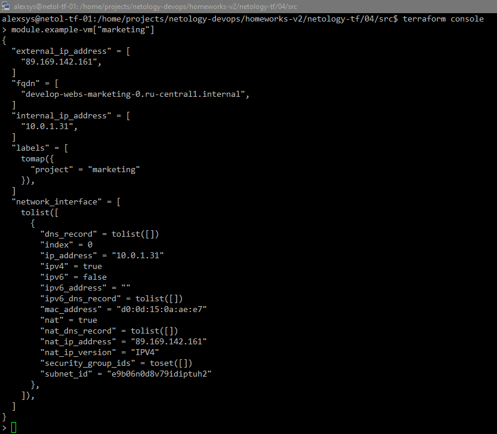
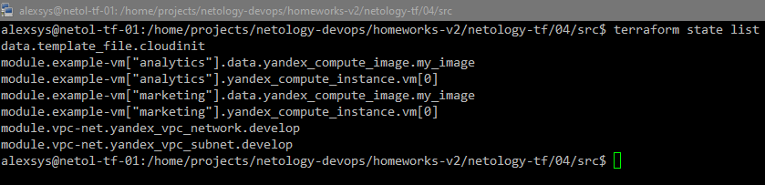

# Продвинутые методы работы с Terraform
### Задание 1
Определим необходимые переменные и создадим наши ВМ:

```terraform
module "example-vm" {
  source         = "git::https://github.com/udjin10/yandex_compute_instance.git?ref=main"
  for_each = toset(var.projects)

  env_name       = var.vms_common_options.env_name
  network_id     = yandex_vpc_network.develop.id
  subnet_zones   = var.vms_common_options.subnet_zones
  subnet_ids     = [yandex_vpc_subnet.develop.id]
  instance_name  = "${var.vms_common_options.instance_name}-${each.key}"
  instance_count = var.vms_common_options.instance_count
  image_family   = var.vms_common_options.image_family
  public_ip      = var.vms_common_options.public_ip
  #добавим, чтобы не тратить денег
  platform = var.vms_common_options.platform
  instance_core_fraction = var.vms_common_options.instance_core_fraction
  preemptible = var.vms_common_options.preemptible
  boot_disk_size = var.vms_common_options.boot_disk_size
  instance_memory = var.vms_common_options.instance_memory

  labels = {
    project = each.value
  }

  metadata = {
    user-data          = data.template_file.cloudinit.rendered
    serial-port-enable = var.vms_common_options.meta_serial-port-enable
  }

}

data "template_file" "cloudinit" {
  template = file("./cloud-init.yml")
  vars = {
    username        = var.vms_ssh_user
    ssh_public_key  = local.vms_ssh_root_key
  }
}

```

При этом файл `cloud-init.yaml` имеет вид

```yaml
#cloud-config
users:
  - name: ${username}
    groups: sudo
    shell: /bin/bash
    sudo: ["ALL=(ALL) NOPASSWD:ALL"]
    ssh_authorized_keys:
      - ${ssh_public_key}

package_update: true
package_upgrade: false
packages:
  - vim
  - nginx
```
В результате получили 2 ВМ


в которых установлен nginx:


Содержимое модуля:


### Заданиие 2
Вынесем создание сети и подсети в отдельный модуль `vpc_dev` и заменим код в основном проекте на его вызов:
```terraform
module "vpc-net" {
  source = "./modules/vpc_dev"
  zone = var.default_zone
  cidr = var.default_cidr
  vpc_name = var.vpc_name
}

```

Содержимое модуля после применения:


Сгенерируем при помощи команды `terraform-docs markdown ./ >README.md` [документацию к модулю](src/modules/vpc_dev/README.md).
### Задание 3
Просмотрим состояние при помощи команды `terraform state list`:



Удаляем модули при помощи команды `terraform state rm`:


Импортируем обратно при помощи команды `terraform import` сначала сети


Потом машины:


В результате план содержит изменения: 


Итоговый код расположен в папке `src` репозитория.
