# Продвинутые методы работы с Terraform
### Задание 1
Используем линтер tflint и сканер checkov.
TFLINT выдал следующие виды предупреждений:
 - terraform_unused_declarations - задекларированные, но неиспользуемые переменные; 
 - terraform_required_providers - отсутствие указанной версии в декларации провайдера;
 - terraform_module_pinned_source - использование ветки main без указания конкретного тега при указании источника удалённого модуля. 

Checkov показал только два вида ошибок, аналогичных последней: 
 - CKV_TF_1: "Ensure Terraform module sources use a commit hash"
 - CKV_TF_2: "Ensure Terraform module sources use a tag with a version number"

### Заданиие 2
Настраиваем S3 и БД.
Создаём сервисный аккаунт `tfplan` c `ydb.editor`

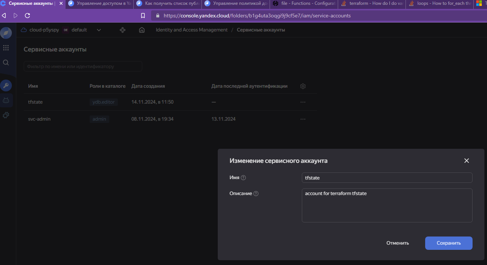

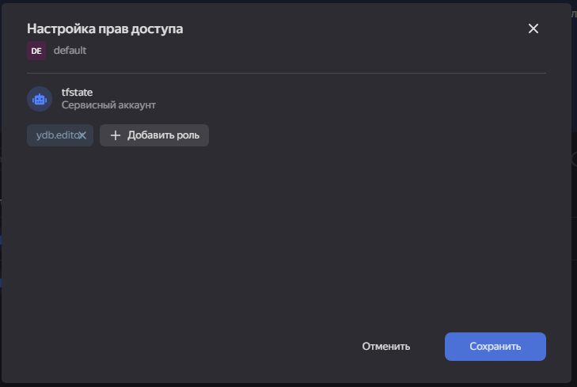

Не забыли сгенерировать статический ключ доступа.

Создали БД `tfstate-lock` с таблицей tfstate-develop

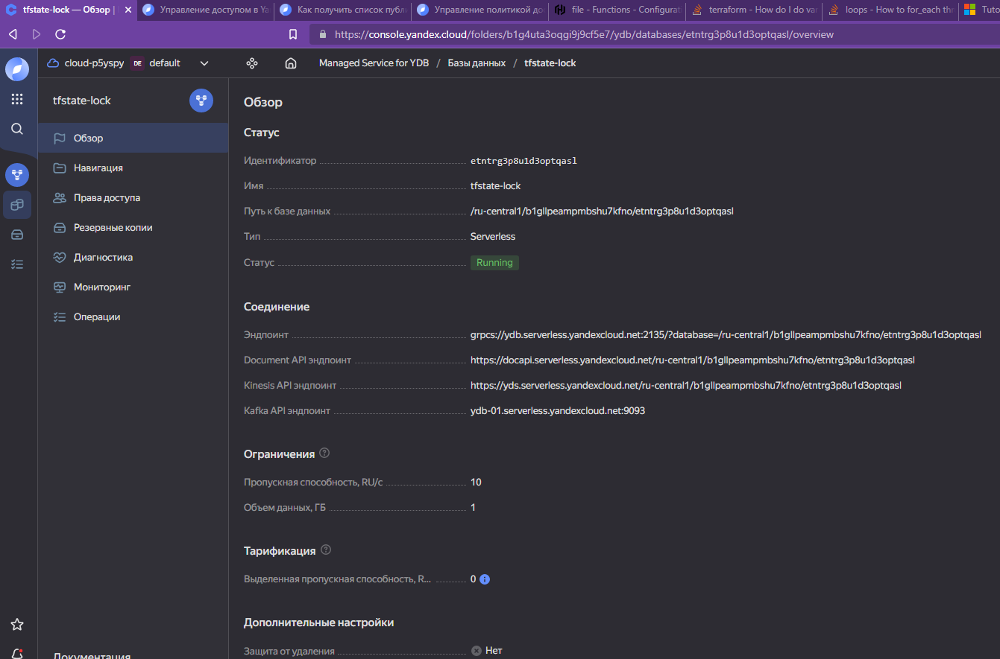
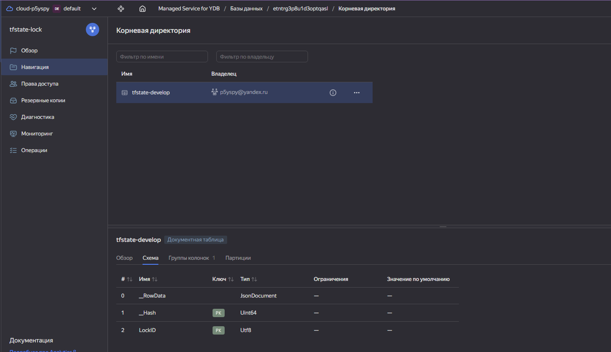

Дали нашему пользователю право редактирования

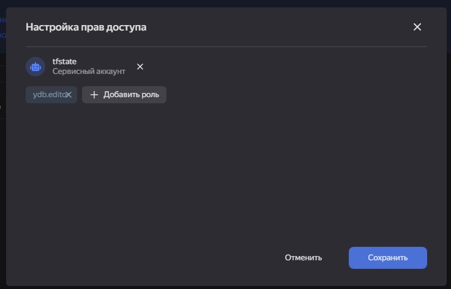

Создали бакет `p5yspy-tfstate-develop`

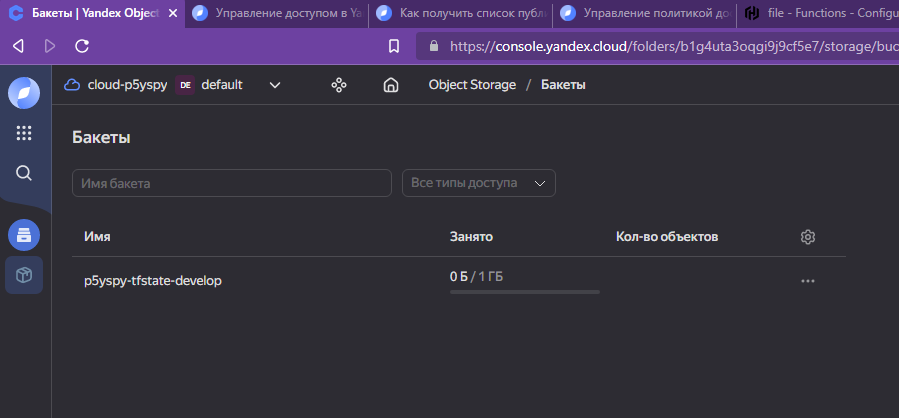

и настроили права для аккаунта.

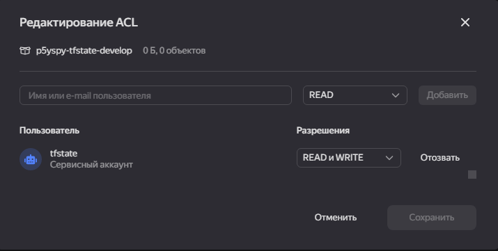

Выполняем `terraform init` и соглашаемся на копирование стейта:

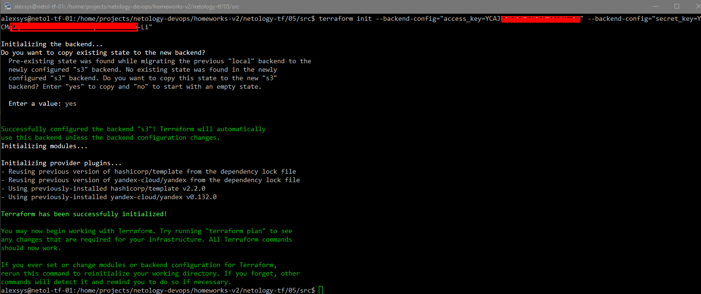

Проверяем блокировку состояния: Открываем консоль и одновременно пытаемся выполнить `terraform apply`. Получили ошибку:

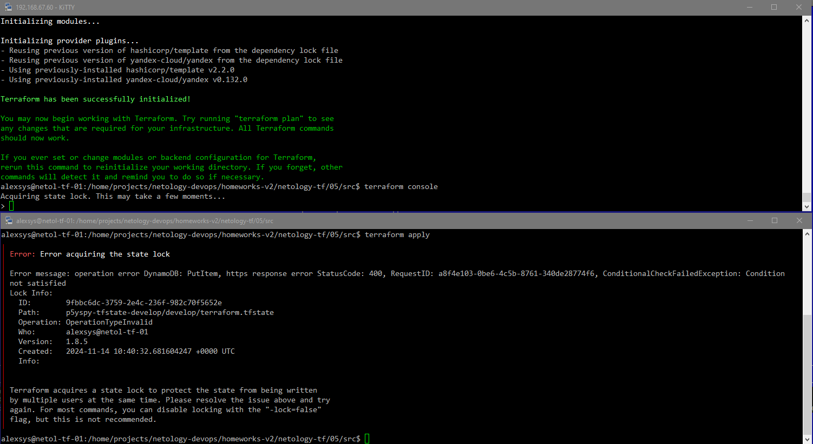

### Задание 3
Проверяем наш код с помощью tflint и checkov.

### Задание 4
Создадим 2 переменные с валидацией:
```terraform
variable "test_ip" {
  type = string
  default = "192.168.0.1"
  #default = "1920.1680.0.1"
  description="ip-адрес"
  validation {
    condition = can(cidrnetmask("${var.test_ip}/32"))
    error_message = "Invalid IP address provided."
  }
}

variable "test_cidr_list" {
  type = list(string)
  default =  ["192.168.0.1", "1.1.1.1", "127.0.0.1"]
  #default = ["192.168.0.1", "1.1.1.1", "1270.0.0.1"]
  description="список ip-адресов"
  validation {
    condition = alltrue([
      for addr in var.test_cidr_list: can(cidrnetmask("${addr}/32"))
    ])
    error_message = "Invalid IP set provided."
  }
}
```
Проверим в консоли сначала с корректными значениями по умолчанию.

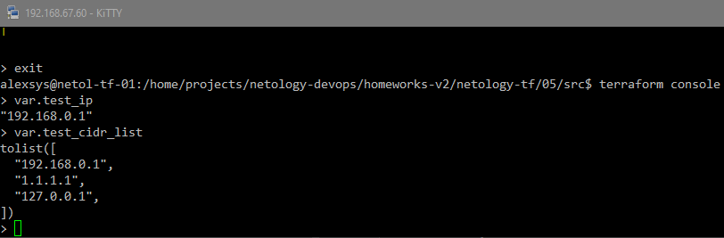

Никаких сообщений, в переменных ожидаемое содержимое.
Теперь изменим значения на некорректные.

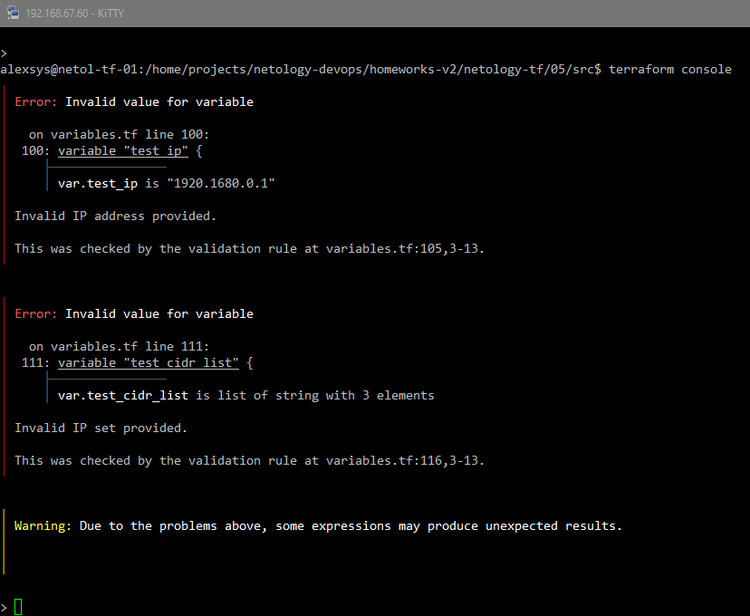

Получили при старте сообщение об ошибках.


Итоговый код расположен в папке `src` репозитория.
